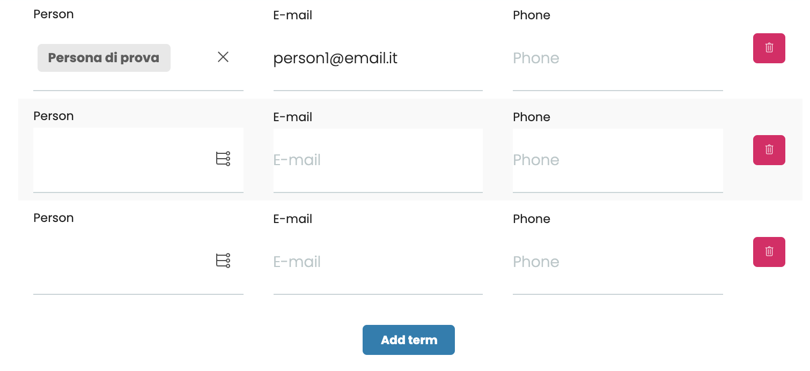

# volto-data-grid-widget

Widget for data grid fields

Install with mrs-developer (see [Volto docs](https://docs.voltocms.com/customizing/add-ons/)) or with:

```bash
yarn add volto-data-grid-widget
```

## Features

This addon will add in your project the Widget to edit Data Grid fields.

It displays fields based on field schema.



### Field schema example

```jsx
{
  fieldsets: [
    {
      id: 'default',
      title: 'Default',
      fields: ['person', 'email', 'phone'],
    },
  ],
  properties: {
    person: {
      title: 'Person',
      widget: 'object_browser',
      mode: 'link',
      allowExternals: false,

      widgetOptions: {
        pattern_options: {
          selectableTypes: ['Persona'],
          maximumSelectionSize: 1,
        },
      },
    },
    email: { title: 'E-mail', type: 'email' },
    phone: { title: 'Phone' },
  },
  required: [],
};
```

#### Other options

These options can be added in the `frontendOptions` of the widget when defining the schema in the backend.

| Option          | Default value |
| --------------- | ------------- |
| `allow_delete`  | `true`        |
| `allow_insert`  | `true`        |
| `allow_reorder` | `false`       |
